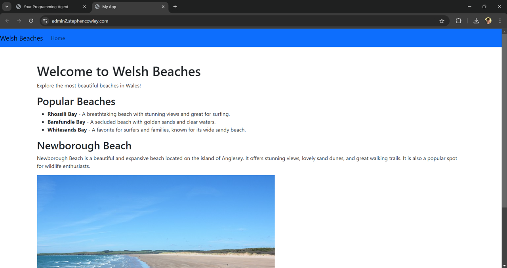

# Programming Agent Server

## Description

Your Programming Agent allows you to discuss with an AI chatbot what sort of custom web app you'd like it to create for you. Within a few seconds you'll see the results! 

This repo contains the main backend code.

For the frontend repo, see the [Programming Agent UI](https://github.com/stephen1cowley/programming-agent-ui). For the contents of the user app Docker container (editted live by the AI), see the [User React App](https://github.com/stephen1cowley/user-react-app).

## Features
- Talk with a ChatGPT-like chat bot
- Discuss changes you'd like to make to the app at each stage
- Drag and drop your own images to be included in the app

### Example




## Architecture

The main front and back-end servers are AWS EC2 instances. The AI-created app is stored as a ECS Fargate container. This makes periodic checks to see if the code in the Amazon S3 bucket has changed. This is changed on-demand by the backend, which comprises a ChatGPT invocation with access to tool calls.


The main frontend is served at `https://stephencowley.com`, where users login with AWS Cognito. From then on, the username is included as a header to requests to the backend http server, `https://api.stephencowley.com`. The user visits their website creation at `https://username.stephencowley.com`.

The current user state is stored in DynamoDB, and the uploaded images are stored in another S3 bucket.

## Installation
### Prerequisites

- An AWS account
- Basic AWS knowledge
- EC2 server running Ubuntu 24
- EC2 role IAM permissions to access S3, DynamoDB, Secrets Manager
- Go v1.22.5

To run a development http server:
```bash
go run main.go
```

For user data to be correctly stored in DynamoDB and S3, you will need to change the constants to match your own table and bucket names in `awsHandlers/dynamoDBHandler.go` and `awsHandlers/s3Handler.go`. Then the http server will be able to change S3 files. 

To create the container that will listen to changes to S3, run a Docker container based on the container [User React App](https://github.com/stephen1cowley/user-react-app). Follow the installation guide for that repo.

The CORS headers added in `apiAgent/apiAgent.go` will need to be changed to allow localhost if running the frontend locally, or removed entirely if just a testing of the endpoints is wanted.

This project contains functions in `awsHandlers/ecrHandler.go` and `awsHandlers/ecsHandler.go` that automate the creation of the container, but this is not required.

You could utilise the YAML spec files to create an automated CI/CD pipeline with AWS CodePipeline, but this is not required.
